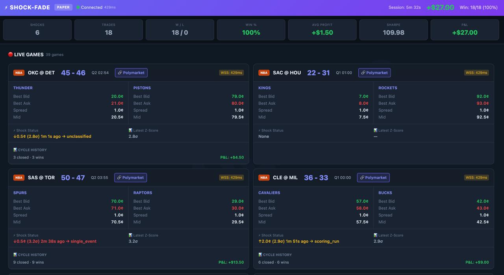
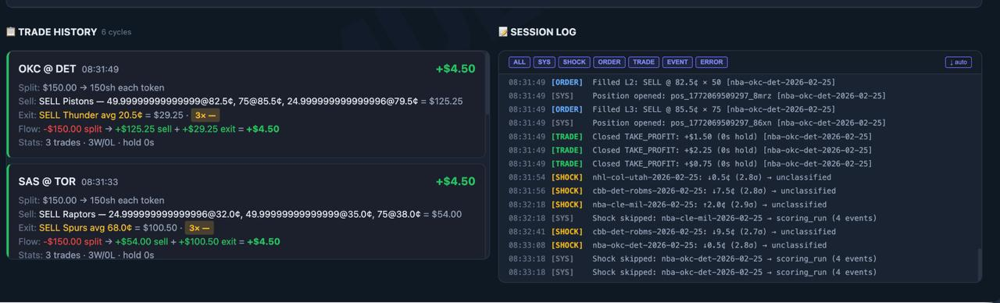

# ⚡ Shock & Fade

**Mean-reversion trading on Polymarket sports moneyline markets.**

Detects mid-game price shocks (>2σ moves) caused by scoring events, classifies them using free league API data, and sells into the overshoot with laddered limit orders — capturing the fade as the market recalibrates.

## How It Works

```
1. PRE-SPLIT    $85 USDC → 85 shares of Team A + 85 shares of Team B
2. DETECT       Price shock: >2σ z-score on 60s rolling window, ≥3¢ absolute move
3. CLASSIFY     Burst-poll free league API (10s cutoff) — only trade single_event shocks
4. SELL         3 laddered GTC limit orders on spiked token: +3¢, +6¢, +9¢
5. CONFIRM      UserChannelWS provides real-time fill events for entry + TP orders
6. EXIT         Adverse event → GTC sell complement at bid+1tick (avoids 3s sports delay)
                Favorable event → hold for mean reversion
                Game decided → winning held shares valued at $1, losing at $0
7. MERGE        Unsold shares merged back to USDC, game slot freed
```

> **Never buy on the book. Always sell.** We pre-split USDC into complementary CTF tokens and sell whichever side spikes. Zero sell fees on Polymarket.

### The Edge

**Event-driven exit** is the key differentiator: only exit on adverse events (shock team scores again), hold on favorable events (opposite team scores). With this approach, **100% of parameter combinations are profitable** in backtesting — vs 15% with static timeout exits.

## Dashboard Preview

**Paper Trading Dashboard** — Monitor live games, shock detection, positions, and P&L in real-time:


*Real-time monitoring: 39 live games, 18/18 trades profitable (+$27 P&L, 100% win rate)*


*Detailed cycle tracking: OKC @ DET earned +$4.50 (3 trades, 3 wins, 0 holds), SAS @ TOR +$4.50*

## Backtest Results (v3 Realistic)

Using actual recorded trade data with 25% queue capture assumption:

| Metric | Value |
|--------|-------|
| ROI | 11% ($107 profit on ~$1,000 capital) |
| Games traded | 18 |
| Win rate | 73.3% |
| Sharpe ratio | 0.55 |
| Profitable param combos | 100% (event-driven exit) |

*Capital: $300 per game cycle, ~3-4 concurrent games on average = ~$1,000 working capital*

## Supported Sports

| Sport | Status | Notes |
|-------|--------|-------|
| NBA | ✅ Primary | Live trading — highest volume, best liquidity |
| CBB | 📊 Recording | Collecting data, running paper trader |
| NHL | ✅ Live | Active since Feb 2026 |
| NFL | ✅ Live | Seasonal (playoffs, Super Bowl) |
| European Soccer | 🔜 Planned | Infrastructure ready via ESPN API |
| MLB | 🔜 Seasonal | API ready |

## Quick Start

### Prerequisites

- Node.js 22+
- Polymarket account with API keys
- MATIC/POL on Polygon for gas (~$0.05/cycle via direct execution)

### Setup

```bash
git clone https://github.com/ic-nightfury/shock-and-fade.git
cd shock-and-fade
npm install
cp .env.example .env   # Edit with your keys
```

### Run Paper Trader (no real money)

```bash
npm run shock-fade:paper
```

Connects to live Polymarket data, detects shocks, simulates fills. Dashboard at `http://localhost:3032`.

### Run Live Trader

```bash
# Dry run (logs but doesn't execute)
npx tsx src/run-shock-fade-live.ts --dry-run

# Live trading (real money!)
npm run shock-fade:live
```

### Run Recorder (collect data for backtesting)

```bash
npm run nhl:record
```

### Run Backtest

```bash
npm run nhl:backtest        # Backtest on recorded data
npm run analyze             # Analyze results
npm run analyze:matrix      # Parameter sweep
npm run analyze:nba-v3      # NBA-specific parameter matrix
```

## Configuration

### Environment Variables

```bash
# Wallet
POLYMARKET_PRIVATE_KEY=0x...        # EOA private key
POLYMARKET_FUNDER=0x...             # Proxy/funder address
AUTH_MODE=PROXY                      # PROXY (gas-free orders) or EOA

# Builder Relayer (optional — DirectExecution bypasses this)
BUILDER_API_KEY=...
BUILDER_SECRET=...
BUILDER_PASS_PHRASE=...

# Network
POLYMARKET_HOST=https://clob.polymarket.com
POLYMARKET_CHAIN_ID=137
RPC_URL=https://polygon-rpc.com

# Shock-Fade Tuning
SHOCK_SIGMA=3.0                     # Z-score threshold
SHOCK_MIN_MOVE=0.03                 # Minimum absolute price move (3¢)
SHOCK_WINDOW_MS=60000               # Rolling window (60s)
SHOCK_LADDER_LEVELS=3               # Number of ladder levels
SHOCK_LADDER_SPACING=0.03           # Spacing between levels as DECIMAL — 0.03 = 3¢. NOT integer!
SHOCK_FADE_TARGET=4                 # Take-profit in CENTS — 4 = 4¢
SHOCK_FADE_WINDOW_MS=600000         # Timeout fallback (600s)
SHOCK_MAX_CONCURRENT_GAMES=2        # Max simultaneous games
SHOCK_MAX_CYCLES_PER_GAME=2         # Max CONCURRENT active cycles, not total
SHOCK_PRICE_MIN=0.07                # Detector: skip shocks on tokens below this mid price
SHOCK_PRICE_MAX=0.85                # Max sell price for ladders — won't sell above this (asymmetric filter)
SHOCK_MAX_PER_GAME=1000             # Max total cycles per game (effectively unlimited)
SHOCK_MAX_CONSEC_LOSSES=3           # Circuit breaker: pause after N consecutive losses
SHOCK_MAX_SESSION_LOSS=30           # Circuit breaker: pause after $N session loss
```

## Architecture

```
┌─────────────────────┐    ┌──────────────────────┐
│  Polymarket WS      │    │  Free League APIs     │
│  (OrderBookWS)      │    │  NBA/NHL/NFL/MLB/ESPN │
│  Real-time prices   │    │  Play-by-play events  │
└────────┬────────────┘    └──────────┬───────────┘
         │                            │
         ▼                            ▼
┌─────────────────────┐    ┌──────────────────────┐
│  ShockFadeDetector   │    │  Event Classification │
│  Z-score + absolute  │───▶│  10s burst-poll       │
│  shock detection     │    │  single_event only    │
└────────┬────────────┘    └──────────┬───────────┘
         │                            │
         ▼                            ▼
┌──────────────────────────────────────────────────┐
│  ShockFadeLive / ShockFadePaper                  │
│  • Laddered GTC sell orders on spiked token      │
│  • Cumulative DCA-blended take-profit            │
│  • Event-driven exit / scoring run protection    │
└────────┬─────────────────────────────────────────┘
         │
         ▼
┌──────────────────────────────────────────────────┐
│  UserChannelWS (Fill Confirmation)               │
│  Real-time fill/cancel events via user WSS       │
│  Primary TP + exit fill confirmation             │
└────────┬─────────────────────────────────────────┘
         │
         ▼
┌──────────────────────────────────────────────────┐
│  On-Chain Execution (DirectExecutionClient)      │
│  SplitClient → USDC → CTF token pairs            │
│  MergeClient → CTF tokens → USDC                 │
│  PolymarketClient → GTC sells at bid+1tick       │
└──────────────────────────────────────────────────┘
```

For detailed architecture documentation, see [docs/ARCHITECTURE.md](docs/ARCHITECTURE.md).  
For full strategy details, see [docs/STRATEGY.md](docs/STRATEGY.md).

## Project Structure

```
src/
├── strategies/
│   ├── ShockFadeDetector.ts       # Z-score shock detection
│   ├── ShockFadeLive.ts           # Live trading engine
│   └── ShockFadePaper.ts          # Paper trading engine
├── services/
│   ├── DirectExecutionClient.ts   # Bypass Builder Relayer (~$0.05/cycle)
│   ├── SplitClient.ts             # USDC → CTF splitting
│   ├── MergeClient.ts             # CTF → USDC merging
│   ├── PolymarketClient.ts        # CLOB order execution
│   ├── OrderBookWS.ts             # Real-time price WebSocket
│   ├── SportsMarketDiscovery.ts   # Market discovery from Gamma API
│   ├── UserChannelWS.ts           # Real-time fill/cancel via user WSS
│   └── WalletBalanceService.ts    # Balance tracking
├── collectors/
│   ├── nhl/NhlShockRecorder.ts    # Multi-sport tick + event recorder
│   └── league-apis/               # Free league API clients (NBA, NHL, NFL, MLB, ESPN)
├── dashboard/
│   ├── ShockFadeDashboard.ts      # WebSocket dashboard server (port 3032)
│   └── shock-fade-ui.html         # Single-file HTML dashboard
├── analysis/                      # Backtest analysis & parameter sweep
├── backtest/                      # Backtest engine
├── tools/                         # Utilities (merge-all, check-balances, etc.)
├── cli/                           # CLI commands (aum, status, merge, sell, etc.)
├── run-shock-fade-live.ts         # Live trader entry point
├── run-shock-fade-paper.ts        # Paper trader entry point
└── run-nhl-shock-recorder.ts      # Recorder entry point

docs/
├── STRATEGY.md                    # Full strategy documentation
├── ARCHITECTURE.md                # System architecture
├── DIRECT_EXECUTION.md            # DirectExecutionClient technical docs
├── PITFALLS.md                    # Known pitfalls & gotchas from live trading
├── RATE_LIMITS.md                 # Polymarket API rate limits
└── archive/                       # Legacy strategy docs
```

## Dashboard

When the paper or live trader is running, open `http://localhost:3032` for a real-time dashboard showing:

- Active markets with live prices
- Detected shocks with classification
- Open positions and P&L
- Order book depth
- Trade history and cycle outcomes

## npm Scripts

| Command | Description |
|---------|-------------|
| `npm run shock-fade:paper` | Paper trading (simulated fills) |
| `npm run shock-fade:live` | Live trading (real money) |
| `npm run nhl:record` | Record tick + event data |
| `npm run nhl:backtest` | Run backtest |
| `npm run analyze` | Analyze backtest results |
| `npm run analyze:matrix` | Parameter sweep |
| `npm run analyze:nba-v3` | NBA parameter matrix v3 |
| `npm run validate` | Validate recording data |
| `npm run aum` | Check account value |
| `npm run status` | Check bot status |
| `npm run merge` | Merge CTF tokens → USDC |
| `npm run sell` | Manual sell |
| `npm run build` | TypeScript compile |

## Systemd Services

```bash
# Recorder (Germany server)
sudo systemctl start polymarket-recorder

# Paper trader (Germany server)
sudo systemctl start shock-fade-paper

# Live trader (production server)
sudo systemctl start shock-fade-live
```

## Hot Reload

Reload `.env` config without restarting (preserves open positions and state):

```bash
# Via systemd
systemctl reload shock-fade-live

# Or manually
kill -HUP <pid>
```

**Only affects new shocks/cycles** — existing open positions keep their original config. The service runs `node` directly (not `npx`) so SIGHUP reaches the correct process.

## Deployment

### Production Server

Deploy via rsync (recommended for servers without git SSH keys):

```bash
# Set your server details
export SERVER="your-server-ip-or-domain"
export REMOTE_DIR="/path/to/shock-and-fade"

# Full deploy
rsync -avz --exclude node_modules --exclude data --exclude .git . root@$SERVER:$REMOTE_DIR/
ssh root@$SERVER "cd $REMOTE_DIR && npm install --omit=dev"
ssh root@$SERVER "systemctl restart shock-fade-live"

# Config-only change (no restart needed)
rsync -avz .env root@$SERVER:$REMOTE_DIR/.env
ssh root@$SERVER "systemctl reload shock-fade-live"
```

**Dashboard:** Access via `http://your-server-ip:3033` (configure port in systemd service).

## Documentation

- **[Strategy](docs/STRATEGY.md)** — Full shock-fade strategy details, capital model, risk management
- **[Architecture](docs/ARCHITECTURE.md)** — System components, data flow, services, deployment
- **[Pitfalls](docs/PITFALLS.md)** — Known gotchas and hard-won lessons from live trading
- **[Direct Execution](docs/DIRECT_EXECUTION.md)** — Bypassing Builder Relayer, Gnosis Safe direct calls
- **[Rate Limits](docs/RATE_LIMITS.md)** — Polymarket API rate limits and mitigation strategies

## License

Private. Not for redistribution.
