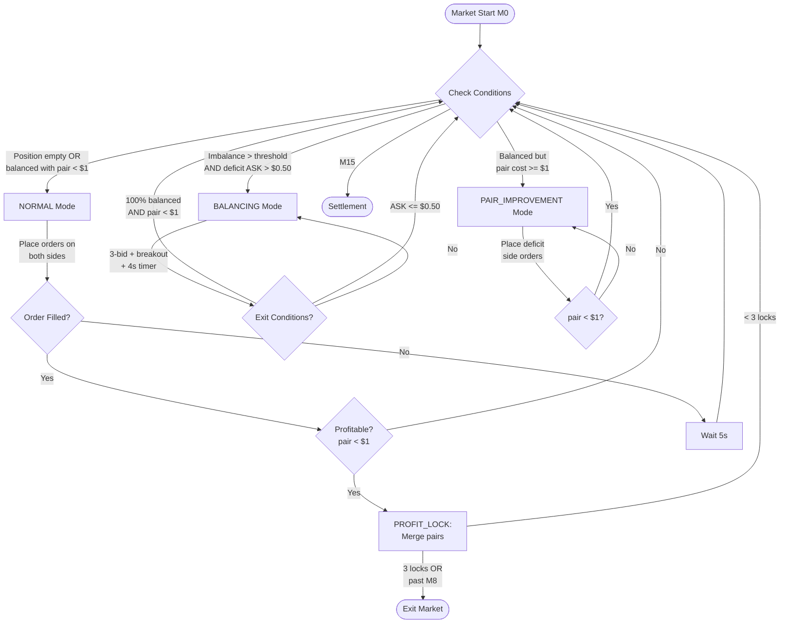

# Arbitrage TradeFill Strategy - Flowchart & Documentation

## Overview

The **ArbitrageSimulation_TradeFill** bot is a market-making strategy for Polymarket's 15-minute binary crypto prediction markets (BTC, ETH, SOL, XRP). It aims to accumulate both UP and DOWN tokens at prices that sum to less than $1.00 (guaranteed profit at settlement).

### Key Concept: Binary Market Arbitrage
- Each 15-minute window has UP and DOWN tokens
- At settlement: winning side pays $1.00, losing side pays $0.00
- If you hold equal amounts of UP and DOWN at avg cost < $1.00, you profit regardless of outcome
- Example: Buy 100 UP @ $0.48 + 100 DOWN @ $0.48 = $96 cost → $100 return = $4 profit

---

## High-Level Architecture

```
┌─────────────────────────────────────────────────────────────────────────────┐
│                        MAIN LOOP (runMarketCycle)                           │
├─────────────────────────────────────────────────────────────────────────────┤
│  1. Find next 15-minute market                                              │
│  2. Initialize WebSocket for real-time prices                               │
│  3. Run periodic checks (every 5 seconds)                                   │
│  4. Settlement at market end (M15)                                          │
│  5. Repeat for next market                                                  │
└─────────────────────────────────────────────────────────────────────────────┘
```

---

## Strategy Mode Flowchart



---

## Mode Descriptions

### 1. NORMAL Mode
**Goal**: Accumulate both UP and DOWN tokens at good prices

```
┌──────────────────────────────────────────────────────────────────┐
│                        NORMAL MODE                                │
├──────────────────────────────────────────────────────────────────┤
│  Entry: Position empty or balanced with pair cost < $1.00        │
│                                                                   │
│  Actions:                                                         │
│  • Place BUY orders on BOTH sides (UP and DOWN)                  │
│  • Use Avellaneda-style inventory skew:                          │
│    - Deficit side: BID + 1¢ (aggressive)                         │
│    - Surplus side: BID - 1¢ (patient)                            │
│  • Order depth based on position size                            │
│                                                                   │
│  Exit: Imbalance exceeds threshold → BALANCING                   │
│        OR pair cost >= $1 → PAIR_IMPROVEMENT                     │
└──────────────────────────────────────────────────────────────────┘
```

### 2. BALANCING Mode (5-Level Bid System)
**Goal**: Fix imbalanced position by buying deficit side and hedging

```
┌──────────────────────────────────────────────────────────────────┐
│            BALANCING MODE (5-Level Bid System)                    │
├──────────────────────────────────────────────────────────────────┤
│  Entry: Imbalance ratio > threshold (e.g., 15%)                  │
│         AND absolute imbalance >= 110 shares                     │
│         AND deficit side ASK > $0.50                             │
│                                                                   │
│  5-LEVEL BID STRUCTURE:                                          │
│  ┌────────────────────────────────────────────────────────────┐  │
│  │  TRACKING LEVELS (move with market):                       │  │
│  │  • L1: BID+1¢ (only on breakout or 5s timeout)            │  │
│  │  • L2: BID (current market)                                │  │
│  │                                                            │  │
│  │  FIXED LEVELS (set at entry, don't move):                 │  │
│  │  • L3: (SOT + 0.49) / 3 + SOT * 2/3  (hedgeTarget=$0.98)  │  │
│  │  • L4: (SOT + 0.49) / 3 * 2 + SOT / 3 (hedgeTarget=$0.97) │  │
│  │  • L5: 0.49 (hedgeTarget=$0.96)                           │  │
│  │                                                            │  │
│  │  SOT = "Start of Trigger" = BID price when entering mode  │  │
│  └────────────────────────────────────────────────────────────┘  │
│                                                                   │
│  SIZE CALCULATION (getLevelSize):                                │
│  ┌────────────────────────────────────────────────────────────┐  │
│  │  baseSize = 0.1 × deficit at entry                        │  │
│  │  size = baseSize × (1 + 2 × ratio)                        │  │
│  │  ratio = (SOT - price) / (SOT - 0.50)                     │  │
│  │                                                            │  │
│  │  Result: 1× size at SOT → 3× size at $0.50               │  │
│  │  (Larger orders at lower prices = better avg cost)        │  │
│  └────────────────────────────────────────────────────────────┘  │
│                                                                   │
│  On BID MOVEMENT:                                                │
│  • Cancel ONLY L1/L2 (tracking levels)                          │
│  • L3/L4/L5 (fixed levels) are PRESERVED                        │
│  • If BID moved UP: place L1 breakout order at BID+1¢           │
│  • Refill L2 at new BID                                          │
│                                                                   │
│  On FILL (any trigger):                                          │
│  • Restart 5s timer (resets countdown)                          │
│  • Place HEDGE at (hedgeTarget - fillPrice)                     │
│  • Phase 1 (trigger < hedge): half-hedge                        │
│  • Phase 2 (trigger >= hedge): full hedge                       │
│  • Track lowest trigger filled (sizing monitor)                 │
│                                                                   │
│  On TIMEOUT (5s no fills):                                       │
│  • Place L1 at BID+1¢ (crosses spread if >= ASK)               │
│  • Refill empty level slots                                     │
│  • Restart 5s timer                                              │
│                                                                   │
│  FINAL HEDGE MODE:                                               │
│  • When trigger side > 20% ahead AND profitable at $0.05       │
│  • Cancel ALL pending orders                                    │
│  • Place single hedge at $0.05 for remaining deficit            │
│  • Stop all new orders, wait for final fill                     │
│                                                                   │
│  Minimum Order Size (Polymarket requirement):                    │
│  • Orders must be >= 5 shares AND >= $1 cost                    │
│  • getMinSizeForPrice(price) enforces this                      │
│                                                                   │
│  Exit Conditions:                                                 │
│  • 100% balanced (UP qty == DOWN qty) AND pair cost < $1.00     │
│  • Trigger ASK dropped to <= $0.50 (no profit margin left)      │
└──────────────────────────────────────────────────────────────────┘
```

**5-Level Bid System Flow:**
```
        ┌─────────────────┐
        │   Enter Mode    │
        └────────┬────────┘
                 │
                 ▼
    ┌────────────────────────────┐
    │ Calculate deficit          │
    │ Set SOT = current BID      │
    │ Calculate L3, L4, L5 fixed │
    │ prices from SOT            │
    └────────────┬───────────────┘
                 │
                 ▼
    ┌────────────────────────────┐
    │ Place 5 levels:            │◄───────────────────────┐
    │ • L1: BID+1¢ (on breakout) │                        │
    │ • L2: BID (tracking)       │                        │
    │ • L3: fixed (target $0.98) │                        │
    │ • L4: fixed (target $0.97) │                        │
    │ • L5: $0.49 (target $0.96) │                        │
    │ Size: 1× at SOT → 3× at 50¢│                        │
    └────────────┬───────────────┘                        │
                 │                                        │
                 ▼                                        │
    ┌────────────────────────────┐                        │
    │    Start 5s timer          │                        │
    └────────────┬───────────────┘                        │
                 │                                        │
    ┌────────────┼────────────────┬──────────────┐       │
    ▼            ▼                ▼              ▼       │
┌────────┐ ┌──────────┐  ┌────────────┐  ┌───────────┐  │
│BID     │ │  FILLED  │  │ TIMEOUT 5s │  │ lockable  │  │
│moved   │ │(any lvl) │  │            │  │ pair <$1  │  │
└───┬────┘ └────┬─────┘  └─────┬──────┘  └─────┬─────┘  │
    │           │              │               │        │
    ▼           │              │               ▼        │
┌──────────────┐│              │        ┌────────────┐  │
│Cancel L1/L2  ││              │        │ EXIT MODE  │  │
│only          ││              │        │ Stop timer │  │
│Preserve      ││              │        └────────────┘  │
│L3/L4/L5      ││              │                        │
│Place new L1  ││              │                        │
│(if breakout) ││              │                        │
└──────┬───────┘│              │                        │
       │        │              │                        │
       │        ▼              ▼                        │
       │ ┌─────────────┐ ┌─────────────────┐           │
       │ │Restart timer│ │Place L1 at      │           │
       │ │Hedge at     │ │BID+1¢           │           │
       │ │hedgeTarget  │ │Refill empty     │           │
       │ │-fillPrice   │ │level slots      │           │
       │ │Phase 1: ½   │ └────────┬────────┘           │
       │ │Phase 2: 1×  │          │                    │
       │ └──────┬──────┘          │                    │
       │        │                 │                    │
       └────────┴─────────────────┴────────────────────┘
```

**Key Features of 5-Level System:**
- **Fixed levels (L3-L5)**: Don't move when BID changes - catches price dips
- **Tracking levels (L1-L2)**: Follow current market for immediate fills
- **Progressive sizing**: Larger orders at lower prices (1× to 3×)
- **Tiered hedge targets**: L1-L2=$0.99, L3=$0.98, L4=$0.97, L5=$0.96
- **Phase-based hedging**: Half-hedge when catching up, full when balanced
- **Sizing monitor**: Track lowest fill to optimize order placement
- **Final hedge mode**: Early exit when profitable at $0.05

### 3. PAIR_IMPROVEMENT Mode
**Goal**: Improve pair cost when balanced but pair cost >= $1.00

```
┌──────────────────────────────────────────────────────────────────┐
│                    PAIR_IMPROVEMENT MODE                          │
├──────────────────────────────────────────────────────────────────┤
│  Entry: Position balanced but pair cost >= $1.00                 │
│                                                                   │
│  Actions:                                                         │
│  • Place orders on BOTH sides to dilute average                  │
│  • Use Avellaneda inventory skew                                 │
│  • Cap order price at: $1.00 - otherSideAvg - 1¢                │
│                                                                   │
│  Example:                                                         │
│  • Current: 100 UP @ $0.55 avg + 100 DOWN @ $0.50 avg           │
│  • Pair cost: $1.05 (losing money)                               │
│  • Buy more DOWN @ $0.44 to dilute DOWN avg                     │
│  • New: 100 UP @ $0.55 + 150 DOWN @ $0.48 = $1.03 pair          │
│  • Keep buying until pair < $1.00                                │
│                                                                   │
│  Exit: Pair cost drops below $1.00 → NORMAL                      │
└──────────────────────────────────────────────────────────────────┘
```

### 4. PROFIT_LOCK (Not a mode, but an action)
**Goal**: Lock in guaranteed profit by merging pairs

```
┌──────────────────────────────────────────────────────────────────┐
│                         PROFIT_LOCK                               │
├──────────────────────────────────────────────────────────────────┤
│  Trigger: Have matched pairs AND pair cost < $1.00               │
│                                                                   │
│  Action: MERGE (Polymarket's redeem function)                    │
│  • UP + DOWN → $1.00 USDC (instant, no waiting for settlement)  │
│                                                                   │
│  Example:                                                         │
│  • Position: 50 UP @ $0.48 + 50 DOWN @ $0.47                    │
│  • Cost: $47.50 total                                            │
│  • Merge 50 pairs → $50 USDC                                     │
│  • Profit: $2.50 locked immediately                              │
│                                                                   │
│  Limits:                                                          │
│  • Max 3 profit locks per market window                          │
│  • After 3rd lock, exit market                                   │
└──────────────────────────────────────────────────────────────────┘
```

---

## Fill Detection (Trade-Based)

The bot uses **realistic trade-based fill detection**, not naive price crossing:

```
┌──────────────────────────────────────────────────────────────────┐
│                    TRADE-BASED FILL DETECTION                     │
├──────────────────────────────────────────────────────────────────┤
│  Our BUY limit order fills when:                                 │
│                                                                   │
│  1. EXACT MATCH: |tradePrice - ourLimit| < 0.5¢                  │
│     → Someone sold at our price                                  │
│                                                                   │
│  2. SWEEP THROUGH: tradePrice < ourLimit                         │
│     AND ourLimit <= bestBid + 1¢                                 │
│     → Aggressive seller swept through our level                  │
│                                                                   │
│  3. PRICE IMPROVEMENT: bestAsk <= ourLimit                       │
│     → Market moved in our favor                                  │
│                                                                   │
│  Partial fills supported based on trade size                     │
└──────────────────────────────────────────────────────────────────┘
```

---

## Key Parameters

| Parameter | Default | Description |
|-----------|---------|-------------|
| `baseFrequency` | 5000ms | Check interval |
| `baseSize` | 5 shares | Core order size |
| `imbalanceThreshold` | 15% | Trigger BALANCING when exceeded |
| `stopMinute` | M8 | Stop new orders after this minute |
| `targetPairCost` | $0.99 | Target for hedge pricing (L1-L2) |
| `maxCapitalPct` | 30% | Max % of balance per market |
| `balancingTimerMs` | 5000ms | No-fill timeout in BALANCING mode |
| `balancingLevels` | 5 | Number of bid levels (L1-L5) |
| `minOrderShares` | 5 | Polymarket minimum order size |
| `minOrderCost` | $1.00 | Polymarket minimum order value |
| `hedgeTargetL1L2` | $0.99 | Hedge target for tracking levels |
| `hedgeTargetL3` | $0.98 | Hedge target for first fixed level |
| `hedgeTargetL4` | $0.97 | Hedge target for second fixed level |
| `hedgeTargetL5` | $0.96 | Hedge target for lowest level ($0.49) |
| `baseSizeMultiplier` | 0.1 | Base size = 0.1 × deficit at entry |
| `sizeScaleRange` | 1× to 3× | Size multiplier from SOT to $0.50 |

---

## Hedge Pricing Logic

```
┌──────────────────────────────────────────────────────────────────┐
│                      HEDGE PRICE CALCULATION                      │
├──────────────────────────────────────────────────────────────────┤
│                                                                   │
│  TIERED HEDGE TARGETS (5-Level System):                          │
│                                                                   │
│    L1 (BID+1¢): hedgePrice = $0.99 - fillPrice                  │
│    L2 (BID):    hedgePrice = $0.99 - fillPrice                  │
│    L3 (fixed):  hedgePrice = $0.98 - fillPrice                  │
│    L4 (fixed):  hedgePrice = $0.97 - fillPrice                  │
│    L5 ($0.49):  hedgePrice = $0.96 - fillPrice                  │
│                                                                   │
│  PHASE-BASED HEDGE SIZING:                                       │
│                                                                   │
│    Phase 1 (triggerQty < hedgeQty): hedgeSize = fillSize / 2    │
│    Phase 2 (triggerQty >= hedgeQty): hedgeSize = fillSize       │
│                                                                   │
│  Example (L3 fill):                                              │
│  • Trigger (UP) filled at $0.55 (L3 fixed level)                │
│  • Hedge (DOWN) placed at $0.98 - $0.55 = $0.43                 │
│  • Total pair cost: $0.55 + $0.43 = $0.98                       │
│  • Profit per pair: $1.00 - $0.98 = $0.02                       │
│                                                                   │
│  FINAL HEDGE MODE:                                               │
│  • Triggered when: triggerQty > hedgeQty × 1.2                  │
│  • AND: can lock profit with hedge at $0.05                     │
│  • All pending orders cancelled                                  │
│  • Single hedge placed at $0.05 for remaining deficit           │
│                                                                   │
│  Why tiered targets:                                             │
│  • Higher fills (L1-L2): tighter margin, faster fills           │
│  • Lower fills (L4-L5): more profit margin, patient fills       │
│  • Progressive sizing: more shares at lower prices              │
└──────────────────────────────────────────────────────────────────┘
```

---

## Complete State Machine

```
                              ┌─────────────┐
                              │  MARKET     │
                              │  START      │
                              └──────┬──────┘
                                     │
                                     ▼
                              ┌─────────────┐
                              │   NORMAL    │◄────────────────────┐
                              │   MODE      │                     │
                              └──────┬──────┘                     │
                                     │                            │
              ┌──────────────────────┼──────────────────────┐     │
              │                      │                      │     │
              ▼                      ▼                      ▼     │
    ┌─────────────────┐    ┌─────────────────┐    ┌─────────────┐ │
    │ Imbalance > 15% │    │ Pair cost >= $1 │    │ Profitable  │ │
    │ AND ASK > $0.50 │    │ (balanced)      │    │ pairs exist │ │
    └────────┬────────┘    └────────┬────────┘    └──────┬──────┘ │
             │                      │                    │        │
             ▼                      ▼                    ▼        │
    ┌─────────────────┐    ┌─────────────────┐    ┌─────────────┐ │
    │   BALANCING     │    │PAIR_IMPROVEMENT │    │ PROFIT_LOCK │ │
    │   MODE          │    │   MODE          │    │ (merge)     │ │
    └────────┬────────┘    └────────┬────────┘    └──────┬──────┘ │
             │                      │                    │        │
             │                      │                    │        │
             │ 100% balanced        │ pair < $1         │        │
             │ AND pair < $1        │                    │        │
             └──────────────────────┴────────────────────┴────────┘
                                     │
                                     │ M15 OR 3 locks
                                     ▼
                              ┌─────────────┐
                              │ SETTLEMENT  │
                              │ / EXIT      │
                              └─────────────┘
```

---

## Dashboard Integration

The bot emits real-time events via WebSocket on port 3002:

| Event | Description |
|-------|-------------|
| `marketSwitch` | New market window started |
| `positionUpdate` | Position/balance changed |
| `orderPlaced` | New order created |
| `orderFilled` | Order fully filled |
| `orderPartial` | Order partially filled |
| `orderCancelled` | Order cancelled |
| `log` | Strategy log message |

---

## Exit Conditions

The bot exits a market window when:

1. **3 Profit Locks** - Maximum profit extraction achieved
2. **Past M8 with profit** - Safe exit after stop minute
3. **Extreme Price** - Trigger ASK <= $0.50 (no margin left)
4. **M15** - Market settlement time reached

---

## Summary

```
┌─────────────────────────────────────────────────────────────────────────────┐
│                        STRATEGY SUMMARY                                      │
├─────────────────────────────────────────────────────────────────────────────┤
│                                                                              │
│  GOAL: Accumulate UP + DOWN pairs at combined cost < $1.00                  │
│                                                                              │
│  NORMAL: Buy both sides at market, balanced accumulation                    │
│  BALANCING: Fix imbalance with timer-based trigger-hedge pairs             │
│  PAIR_IMPROVEMENT: Dilute avg cost when pair >= $1.00                       │
│  PROFIT_LOCK: Merge profitable pairs to lock gains                          │
│                                                                              │
│  KEY INSIGHT: Every matched pair returns $1.00 at settlement                │
│               If cost < $1.00, profit is guaranteed                         │
│                                                                              │
└─────────────────────────────────────────────────────────────────────────────┘
```
